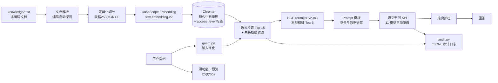

# Finance RAG Assistant — 企业财务知识库 RAG 系统

基于 LangChain 的企业级 RAG 知识库问答系统：覆盖文档解析 → 差异化切分 → 向量化 → 语义检索 → 本地精排 → LLM 生成的完整链路，**安全内建**（三级权限隔离、限流、审计、Prompt 护栏），配套 **RAGAS 四维评估体系**与三轮生成模型对照实验。

## 核心特性

| 模块 | 说明 |
|---|---|
| RAG 全链路 | 多编码自适应文档解析（UTF-8/GBK 等 5 种编码自动探测）；表格/文本双模式差异化切分（250/80 与 300/50，由评估实验选型）；DashScope Embedding 向量化；Chroma 持久化存储 |
| 检索增强 | 语义召回 Top-15 → 本地 BGE-reranker-v2-m3 交叉编码精排 Top-5（毫秒级、零 API 成本、数据不出内网） |
| 模型服务治理 | 通义千问百炼 API 配置化接入；11 个候选模型自动降级链，启动探测、403/429 秒切，额度耗尽服务不断 |
| 权限隔离 | 文档级三级权限（public / internal / confidential），向量库 Metadata 过滤实现**检索级**权限控制；未知角色默认降级（fail-closed） |
| 安全护栏 | 加固 System Prompt + 输入净化（防注入）+ 输出敏感词过滤；滑动窗口限流（20 次/60 秒） |
| 审计追溯 | JSONL 审计日志：用户、问题、答案、召回来源、权限级别、延迟、Token 全链路留痕 |
| 评估体系 | RAGAS 四维指标（忠实度/答案相关度/检索精度/检索召回），20 条分层评估集（事实 8 / 综合 8 / 拒答 4），评估链路与生产模型配置一致 |

## 系统架构



## 快速开始

```bash
# 1. 克隆并安装依赖
git clone https://github.com/<你的用户名>/finance-rag-assistant.git
cd finance-rag-assistant
pip install -r requirements.txt

# 2. 配置密钥（Windows 用 copy）
cp .env.example .env        # 填入你的 DASHSCOPE_API_KEY

# 3. 下载 Reranker 模型到 models/ 目录（ModelScope 或 HuggingFace）
#    models/BAAI--bge-reranker-v2-m3/snapshots/master/...

# 4. 运行（首次启动自动构建知识库，之后从本地加载）
python main.py
```

Docker 方式：

```bash
docker build -t finance-rag .
docker run -it --rm -v $(pwd)/models:/app/models finance-rag
```

## 权限模型演示

| 角色 | 可访问级别 | 示例 |
|---|---|---|
| employee | public | 差旅制度、报销流程 |
| manager | public + internal | 月度成本执行表 |
| admin | 全部 | 报销单据台账（含姓名、金额） |

启动后输入 `role` 可随时切换身份，越权提问会检索不到 confidential 文档（权限在**检索层**生效，不是生成层提示词约束）。

## 评估结果：三轮生成模型对照实验

固定检索链路不变，仅切换生成模型策略，20 条评估集（含 4 条拒答型）：

| 生成策略 | 忠实度 | 答案相关度 | 检索精度 | 检索召回 |
|---|---|---|---|---|
| 思考模型（v1） | 0.9639 ¹ | 0.4956 | 0.8585 | 0.8500 |
| 非思考小模型（v2） | 0.8488 | 0.5111 | 0.8669 | 0.9000 |
| **关思考旗舰（最终选型）** | **0.8594** | **0.5546** | **0.8756** | **0.9250** |

¹ v1 忠实度为剔除 4 条错误拒答（NaN）后的均值。v1 中检索上下文第一条即答案却拒答的 **错误拒答（false refusal）** 问题，由评估体系暴露并修复。

**核心结论**：三轮实验检索指标波动 ≤0.01，波动全部来自生成端——RAG 质量瓶颈常在生成模型行为校准（拒答倾向 vs 过度生成），评估体系必须覆盖生成行为。答案相关度受拒答型问题算法性拉低（拒答答案反推问题相似度天然低），属评估口径问题而非质量缺陷。

## 安全特性（对齐大模型应用安全治理专项）

- **密钥治理**：API Key 全部走 `.env` 配置化，仓库零硬编码，`.gitignore` 隔离
- **数据分级**：文档按敏感度三级定级（文件名关键词自动分类），检索层强制过滤
- **审计日志**：JSON Lines 追加写，"谁在何时问了什么"可追溯
- **Prompt 安全**：加固 System Prompt + 输入注入过滤 + 输出敏感词过滤（生产版建议叠加意图分类模型做分级处置）
- **访问控制**：角色-权限映射 fail-closed + 限流 + 目录权限收敛
- **供应链**：依赖锁定 + `pip-audit` 漏洞扫描（见下方开发指南）

## 开发指南

```bash
# 精确锁定当前环境依赖（推荐提交 lock 文件）
pip freeze | findstr /I "langchain openai chromadb sentence-transformers ragas datasets dotenv numpy pandas" > requirements.lock.txt

# 依赖漏洞扫描
pip install pip-audit
pip-audit -r requirements.txt

# 运行评估（需先配置 .env）
python evaluate.py
```

## 目录结构

```
.
├── main.py               # RAG 主链路 + 权限过滤 + 限流 + 降级
├── evaluate.py           # RAGAS 四维评估（并发查询 + 自动降级）
├── eval_dataset.py       # 20 条分层评估集（事实/综合/拒答）
├── config.py             # 配置加载（.env + 模型路径）
├── guard.py              # Prompt 护栏：输入净化 + 输出过滤
├── audit.py              # JSONL 审计日志 + 查询计时
├── roles_config.py       # 角色-权限映射（fail-closed）
├── knowledge/            # 演示语料（虚构公司，已脱敏）
├── prompts/              # Prompt 模板外置
├── models/               # 本地 Reranker 模型（不入库）
└── requirements.txt
```

## License

MIT
